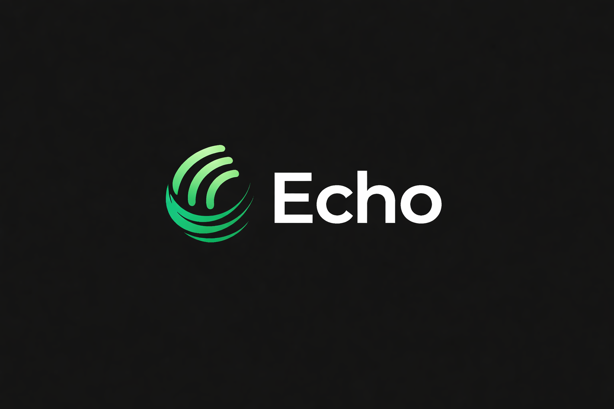

<a id="guide-top"></a>

<div align="center">
  

  <p>
    <strong>Echo helps you think and respond during meetings, then gets out of the way so you can focus.</strong>
  </p>
  <p>
    It also drives your mouse and keyboard through saved routines, so the repetitive parts of your computer work don't have to be yours anymore.
  </p>
</div>

---

## Contents

- [What Echo does](#what-echo-does)
- [Download and install](#download-and-install)
- [First launch](#first-launch)
- [Setting up your AI and speech provider](#setting-up-your-ai-and-speech-provider)
- [Meeting Mode](#meeting-mode)
- [Focus Mode](#focus-mode)
- [Ping: let Echo drive](#ping-let-echo-drive)
- [Workflow Map: chain your routines together](#workflow-map-chain-your-routines-together)
- [Dictation](#dictation)
- [Connecting mail, calendar, and issue trackers](#connecting-mail-calendar-and-issue-trackers)
- [Your data and privacy](#your-data-and-privacy)
- [Pricing and our commitment to keeping it affordable](#pricing-and-our-commitment-to-keeping-it-affordable)
- [Getting help](#getting-help)
- [License](#license)

---

## What Echo does

Echo is a desktop app with three ways of working, and it switches between them instead of asking you to live inside one chat window.

During a call, a small floating bar sits at the top of your screen. It listens to the meeting and to your own microphone, and it only replies when you ask it to, by tapping a quick action, never on its own. When the call ends, Echo pulls out the action items and follow-up tasks people mentioned, so you don't have to relisten to catch them.

Away from calls, Focus Mode replaces that bar with a small task list anchored to the corner of your screen, so you can see what's next without opening a full app. Action items from a meeting can turn into tasks here with one click.

And when you have a repetitive task on your own computer, Ping can do it for you: describe what you want done, and Echo takes over your mouse and keyboard, watching the screen and working through it the way you would, with a kill switch always one keypress away.

<p align="right">(<a href="#guide-top">back to top</a>)</p>

## Download and install

Download the installer for your operating system:

**[Download Echo →](https://github.com/KSWORK2001/Echo-releases/releases/latest)**

- **Windows**: run the installer, then launch Echo from the Start menu.
- **macOS**: open the disk image and drag Echo into Applications.
- **Linux**: installers are provided per distribution on the same download page.

Echo checks for updates on its own once installed (**Settings → Check for updates**), so you only need to download it fresh the first time.

> **A note for Mac users:** the first time you open Echo, macOS may say the app is "damaged" and refuse to open it. This is a security check on downloaded apps that haven't gone through Apple's separate paid notarization program yet, not a problem with the file itself. Open **Terminal** and run:
> ```bash
> xattr -d com.apple.quarantine ~/Downloads/Echo_*.dmg
> ```
> Then open the disk image and install as normal. You only need to do this once; updates after that install cleanly on their own.

<p align="right">(<a href="#guide-top">back to top</a>)</p>

## First launch

Echo will ask for a few permissions the first time it needs them, never all at once:

- **Microphone**: so it can hear you during a meeting or while dictating.
- **Screen recording** (macOS): so it can capture what's happening on your screen when you use a screenshot quick action or Ping.
- **Accessibility** (macOS): so it can type on your behalf during dictation and drive your mouse and keyboard during a Ping run.

You can grant each one when Echo actually asks for it. If a permission gets denied by accident, the related feature will tell you what's missing and point you to the right System Settings page rather than failing silently.

<p align="right">(<a href="#guide-top">back to top</a>)</p>

## Setting up your AI and speech provider

Echo works out of the box. By default, it transcribes speech using a speech model that runs directly on your computer, and it generates replies through your own Claude subscription (if you have Claude Code installed and signed in), so there's nothing extra to configure to get started.

If you'd rather use a different AI service or a cloud speech provider, open **Settings** or **Connections** and switch it there. Echo supports the major hosted AI providers as well as any service that accepts a simple web request, and you can add your own API key for whichever one you choose.

<p align="right">(<a href="#guide-top">back to top</a>)</p>

## Meeting Mode

Tap the headphones icon on the floating bar, or let Echo prompt you when it notices a call has started, and it begins listening to both the meeting audio and your own microphone. The transcript keeps the two apart, so when you later ask Echo a question about the call, it knows the difference between what you said and what everyone else said.

Echo never jumps in on its own. While you're on the call, you can:

- Tap a **quick action** to get a suggested reply, a summary of what's been said so far, or an answer to a question you type in, with the live transcript included automatically as context.
- Attach a **screenshot**, a file, or a saved chat to give a quick action extra context for that one question.
- Switch a toggle to pick a **faster or more thorough model**, and how long you want replies to be.
- Flip to **Speaker Notes** to read from prepared notes on the same window you're sharing, cycling between multiple notes with a keypress.

When you end the call, Echo reviews the transcript and pulls out **action items** (things someone committed to do) and **draft tickets** (work worth turning into a JIRA or GitHub issue), which show up in your chat history ready to edit, approve, or send.

<p align="right">(<a href="#guide-top">back to top</a>)</p>

## Focus Mode

Switch to Focus Mode from the dashboard, and the floating bar is replaced by a small, semi-transparent panel that stays out of your way in the corner of the screen. It shows your open tasks, ranked by importance, with a due date and label if you set one.

You can work through it entirely from the keyboard: arrow keys move between tasks, Enter marks one done, `U` undoes a mistake, and a couple of shortcuts nudge the panel around the screen or dim it if it's distracting. An optional lofi soundtrack plays alongside it if you want background music without leaving the app.

<p align="right">(<a href="#guide-top">back to top</a>)</p>

## Ping: let Echo drive

Open **Ping** from the dashboard, describe a task in plain language, and Echo takes a screenshot, decides what to click or type next, does it, and checks the result, repeating until the task is done. It's the same thing you'd do by hand, just automated: filling out a repetitive form, clicking through a multi-step process, moving files around, anything with a visible, repeatable set of steps.

A few things we built in specifically because Echo is touching your mouse and keyboard:

- **A kill switch that always works.** Press `Ctrl+Alt+Esc` at any moment and the run stops immediately, on both Windows and Mac.
- **It yields to you.** If you start typing or moving your own mouse while Echo is running, it pauses and waits for you to finish before it acts again, so it never fights you for control.
- **It shows its work.** Every step Echo takes appears in a live feed with a short explanation of why, so you can watch what it's doing and stop it if something looks off.
- **It gives your cursor back.** Echo returns your mouse pointer to wherever it was right after each click, so your desktop doesn't feel like someone else was using it.

Save a routine once, and you can run it again with one click, put it on a daily schedule, or have it trigger automatically when a meeting starts or ends.

<p align="right">(<a href="#guide-top">back to top</a>)</p>

## Workflow Map: chain your routines together

If you have more than one saved Ping routine, the **Workflow Map** lets you connect them on a canvas: drag a line from one routine to the next, and the second runs automatically when the first finishes, whether it succeeded, failed, or either way, with an optional pause in between.

You can also drop in a **Wait** block to pause the chain for a set number of minutes, a **Notify** block to show a message when the chain gets there, or an **Until** block to hold the chain until a specific time of day. The map shows everything live: which routine is currently running, which ones are queued, and a running log of what happened and when.

<p align="right">(<a href="#guide-top">back to top</a>)</p>

## Dictation

Hold your dictation key anywhere on your computer, not just inside Echo, speak, and let go. Echo transcribes what you said on-device and types it directly into whatever text field currently has focus, whether that's an email, a document, or a chat window. Set or change the keybind from **Keybinds** in the dashboard.

<p align="right">(<a href="#guide-top">back to top</a>)</p>

## Connecting mail, calendar, and issue trackers

All of these are optional, and Echo works fully without any of them connected.

- **Gmail or Outlook**: read, reply to, archive, and delete mail from inside Echo, and let it scan for meeting invites and to-dos buried in your inbox that can become a calendar event or a task in one click.
- **Google Calendar**: see your next event in the sidebar, and turn a meeting proposal Echo found in your email into a real event without leaving the app.
- **GitHub or JIRA**: send a draft ticket straight from a meeting's action items into a real issue, with one click, once you've connected your account.

Connect any of these from the **Connections** page in the dashboard.

<p align="right">(<a href="#guide-top">back to top</a>)</p>

## Your data and privacy

Your conversations, tasks, and saved routines are stored on your own computer, not on a server we run. Speech-to-text runs on your machine by default, so a recording doesn't have to leave it to become a transcript. When you use your own Claude subscription for AI replies, those requests go through your account, not ours.

Echo only calls the AI when you ask it to during a meeting; it never listens in and summarizes on its own. Anything you connect, mail, calendar, GitHub, JIRA, is opt-in, and disconnecting removes Echo's access immediately. Account credentials and API keys are stored using your operating system's own secure credential storage, the same place your browser and other apps keep passwords.

<p align="right">(<a href="#guide-top">back to top</a>)</p>

## Pricing

Echo is free. There's no license key, no account to create, no trial period, and no paid tier holding features back.

That's possible because of how it's built. The two things that would normally run up a bill, speech-to-text and the AI itself, don't route through servers we pay for: speech is transcribed by a model running on your own machine, and AI replies go through your own Claude subscription or whichever provider you configure with your own key. You're never paying us a margin on top of that, because there's no metered service in between.

If Echo ever does need paid infrastructure, we're committed to pricing it as close to cost as we can sustainably manage, and to keeping the free path fully capable rather than turning it into a trial of the real thing.

<p align="right">(<a href="#guide-top">back to top</a>)</p>

## Getting help

Something broken, confusing, or missing? Reach out directly:

- Email: <a href="mailto:work.karan2001@gmail.com">work.karan2001@gmail.com</a>
- Portfolio / more about the developer: <a href="https://kswork2001.github.io/portfolio">kswork2001.github.io/portfolio</a>

<p align="right">(<a href="#guide-top">back to top</a>)</p>

## License

Echo is proprietary software. Copyright (c) 2026 Karan Shrivastava, all rights reserved.

Installing Echo gives you a personal license to use it on your own devices. It doesn't grant any right to the source code, and redistributing or modifying the app isn't permitted without written permission. The full terms are in the [LICENSE](LICENSE) file included with the app.

Echo is built on open-source components that remain under their own licenses, and nothing here limits your rights under those.

<p align="right">(<a href="#guide-top">back to top</a>)</p>
